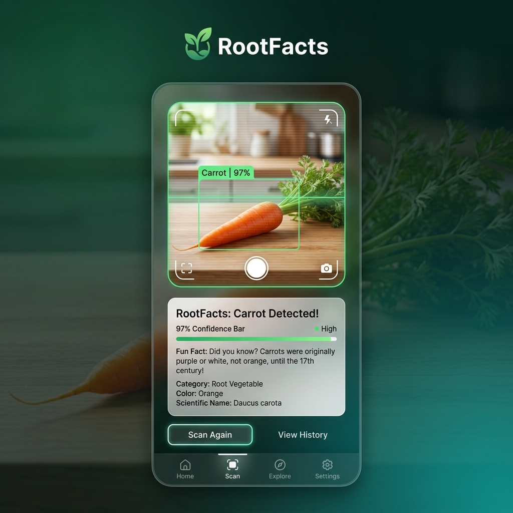

<!-- portfolio -->
<!-- slug: rootfacts-vegetable-detector -->
<!-- title: RootFacts - AI Vegetable Detector -->
<!-- description: Aplikasi PWA deteksi sayuran secara real-time menggunakan TensorFlow.js dan Transformers.js dengan fun fact berbasis AI -->
<!-- image: public/screenshots/rootfacts_banner.png -->
<!-- tags: react, vite, tensorflow.js, transformers.js, pwa, computer-vision -->

# 🥦 RootFacts - Detektor Sayuran AI



Aplikasi Progressive Web App yang mendeteksi sayuran secara real-time menggunakan **TensorFlow.js** (Computer Vision) dan menghasilkan fun fact tentang sayuran tersebut menggunakan **Transformers.js** (Generative AI) — semuanya berjalan **100% di browser**, tanpa server.

> 🌐 **[Live Demo](https://submission-computer-vision-web.vercel.app/)**
>
> 🇬🇧 **[English Version](README.md)**

---

## 👨‍💻 Pengembang

| Nama |
|------|
| Daffa |

---

## 🧠 Deskripsi

**RootFacts** adalah aplikasi AI berbasis browser yang menggabungkan dua kemampuan machine learning:

1. **Computer Vision** — Mengidentifikasi 18 jenis sayuran dari kamera menggunakan model Teachable Machine yang ditenagai TensorFlow.js
2. **Generative AI** — Menghasilkan fun fact tentang sayuran yang terdeteksi menggunakan model bahasa Flan-T5 via Transformers.js
3. **PWA Offline-First** — Bisa digunakan sepenuhnya secara offline setelah pemuatan awal berkat caching service worker

### Sayuran yang Dapat Dideteksi (18 Kelas)

| | | | |
|---|---|---|---|
| 🫱 Beetroot | 🌶️ Paprika | 🥬 Kubis | 🥕 Wortel |
| 🥦 Kembang Kol | 🌶️ Cabai | 🌽 Jagung | 🥒 Mentimun |
| 🍆 Terong | 🧄 Bawang Putih | 🫚 Jahe | 🥬 Selada |
| 🧅 Bawang Bombay | 🫛 Kacang Polong | 🥔 Kentang | 🫱 Lobak |
| 🫘 Kedelai | 🥬 Bayam | | |

---

## ⚙️ Teknologi yang Digunakan

### AI & Machine Learning
- **TensorFlow.js** `v4.22` — Inferensi ML di perangkat dengan backend adaptif (WebGPU → WebGL fallback)
- **Transformers.js** `v3.8` — Model Hugging Face di browser (WebGPU → WASM fallback)
- **Teachable Machine** — Model klasifikasi gambar (berbasis MobileNet)
- **Xenova/flan-t5-small** — Model generasi teks terkuantisasi (`q4` dtype)

### Frontend
- **React** `v19` — Framework UI
- **Vite** `v6` — Build tool dan dev server
- **Lucide React** — Sistem ikon
- **CSS3** — Styling modern dengan glassmorphism dan animasi

### PWA & Offline
- **vite-plugin-pwa** — Pembuatan service worker otomatis
- **Workbox** — Strategi precaching dan runtime caching

---

## 🚀 Memulai

### Prasyarat

- **Node.js** 18+ dan npm terinstal
- Perangkat dengan **webcam** (atau kamera smartphone)
- Browser modern dengan dukungan **WebGPU** atau **WebGL**

### Instalasi

```bash
# Clone repositori
git clone <repo-url>
cd submission

# Instal dependensi
npm install

# Jalankan server pengembangan
npm run dev
```

Aplikasi akan berjalan di:
```
http://localhost:3001
```

### Build Produksi

```bash
npm run build
npm run preview
```

---

## 🧩 Struktur Proyek

```
submission/
├── public/
│   ├── model/
│   │   ├── model.json           # Topologi model TF.js
│   │   ├── metadata.json        # Label & konfigurasi (18 kelas)
│   │   └── weights.bin          # Bobot model
│   ├── icons/
│   │   ├── icon-192x192.png     # Ikon PWA
│   │   ├── icon-512x512.png     # Ikon PWA
│   │   └── apple-touch-icon.png # Ikon iOS
│   └── favicon.ico
│
├── src/
│   ├── components/
│   │   ├── Header.jsx           # Header aplikasi dengan status model
│   │   ├── CameraSection.jsx    # Feed kamera, kontrol & pengaturan
│   │   └── InfoPanel.jsx        # Hasil deteksi & fun fact
│   ├── hooks/
│   │   └── useAppState.js       # Manajemen state global (useReducer)
│   ├── services/
│   │   ├── DetectionService.js  # Pemuatan model TF.js & prediksi
│   │   ├── CameraService.js     # Manajemen stream kamera WebRTC
│   │   └── RootFactsService.js  # Generasi teks Transformers.js
│   ├── utils/
│   │   └── config.js            # Konfigurasi, tone, threshold
│   ├── App.jsx                  # Aplikasi utama dengan loop deteksi
│   ├── main.jsx                 # Entry point
│   └── index.css                # Styles global
│
├── index.html                   # Template HTML dengan meta tag PWA
├── vite.config.js               # Konfigurasi Vite + plugin PWA
├── package.json
├── STUDENT.txt                  # URL deployment
├── README.md                    # Versi Inggris
└── README.id.md                 # File ini (Bahasa Indonesia)
```

---

## 🧠 Cara Kerja

```
┌─────────────┐    ┌──────────────────┐    ┌───────────────────┐
│   Kamera     │───▶│  TensorFlow.js   │───▶│  Transformers.js  │
│   Stream     │    │  (Deteksi)       │    │  (Generasi Fakta) │
└─────────────┘    └──────────────────┘    └───────────────────┘
       │                    │                        │
  getUserMedia()     predict() dengan        generateFacts() dengan
  WebRTC API         await data() (async)    Flan-T5-small (q4)
                     Disposal tensor         Prompt berbasis tone
                     manual                  (lucu/profesional/
                     WebGPU → WebGL          santai/normal)
```

1. **Pemuatan Model** — Kedua model AI dimuat secara paralel saat aplikasi dimulai
2. **Aktivasi Kamera** — Pengguna mengetuk "Mulai Scan" untuk memulai stream kamera WebRTC
3. **Deteksi Real-time** — Frame ditangkap dan diberikan ke TensorFlow.js setiap 100ms
4. **Pengecekan Kepercayaan** — Hanya deteksi di atas 70% yang diterima
5. **Generasi Fun Fact** — Nama sayuran dikirim ke Flan-T5 dengan prompt berbasis tone
6. **Tampilkan Hasil** — Nama sayuran, bar kepercayaan, dan fun fact ditampilkan
7. **Salin & Bagikan** — Pengguna dapat menyalin fun fact ke clipboard

---

## ✨ Fitur

### 🎯 Computer Vision
- **Backend Adaptif** — WebGPU (tercepat) dengan fallback WebGL
- **Inferensi Async** — Menggunakan `await tensor.data()` untuk kompatibilitas WebGPU
- **Manajemen Memori** — Disposal tensor secara manual (tanpa kebocoran memori)
- **Deteksi 18 Kelas** — Mengenali berbagai jenis sayuran
- **Threshold Konfigurabel** — Minimum kepercayaan 70%

### 🤖 Generative AI
- **Generasi Teks di Perangkat** — Tidak perlu panggilan API
- **4 Mode Nada** — Normal, Lucu, Profesional, Santai
- **Model Terkuantisasi** — dtype `q4` untuk pemuatan cepat dan ukuran kecil
- **Backend Adaptif** — WebGPU dengan fallback WASM

### 📱 PWA & Offline
- **Dapat Diinstal** — Tambahkan ke layar utama di ponsel
- **Dukungan Offline** — Service worker meng-cache semua aset
- **Caching Model** — File model TF.js di-precache via Workbox
- **Runtime Caching** — Unduhan model Hugging Face di-cache untuk penggunaan offline

### 🎨 UI/UX
- **Desain Mobile-first** — Dioptimalkan untuk penggunaan smartphone
- **Feed Kamera Real-time** — Streaming video yang mulus
- **State Loading** — Feedback jelas saat pemuatan model dan analisis
- **Salin ke Clipboard** — Berbagi fun fact dengan satu ketukan
- **Kontrol FPS** — Frame rate yang dapat disesuaikan (15-60 FPS)
- **Pergantian Kamera** — Toggle kamera depan/belakang

---

## 🎮 Panduan Penggunaan

1. **Buka aplikasi** dan tunggu status "Model AI Siap" muncul
2. **Ketuk tombol scan** (lingkaran hijau) untuk memulai kamera
3. **Arahkan ke sayuran** — aplikasi mendeteksinya secara otomatis
4. **Baca fun fact** yang dihasilkan tentang sayuran yang terdeteksi
5. **Ubah nada** — pilih antara lucu, profesional, santai, atau normal
6. **Salin fakta** — ketuk tombol salin untuk berbagi dengan teman
7. **Hentikan scan** — ketuk tombol lagi untuk berhenti

---

## 🔧 Konfigurasi

### Threshold Deteksi

Di `src/utils/config.js`:

```javascript
export const APP_CONFIG = {
  detectionConfidenceThreshold: 70,  // Kepercayaan minimum (0-100)
  analyzingDelay: 2000,              // Delay sebelum membuat fakta
  factsGenerationDelay: 2000,        // Delay setelah fakta dihasilkan
  detectionRetryInterval: 100        // Interval loop deteksi (ms)
};
```

### Mode Nada

```javascript
export const TONE_CONFIG = {
  availableTones: [
    { value: 'normal', label: 'Normal' },
    { value: 'funny', label: 'Lucu' },
    { value: 'professional', label: 'Profesional' },
    { value: 'casual', label: 'Santai' }
  ]
};
```

### Ganti Model AI

Di `src/services/RootFactsService.js`:

```javascript
// Ganti dengan model text2text Hugging Face lainnya
this.generator = await pipeline('text2text-generation', 'Xenova/flan-t5-small', {
  dtype: 'q4',
  device: this.currentBackend
});
```

---

## 🐛 Pemecahan Masalah

### Kamera Tidak Berfungsi
- Periksa izin browser untuk akses kamera
- Di desktop: aplikasi otomatis fallback ke `{ video: true }` jika `facingMode` gagal
- Pastikan menggunakan HTTPS atau localhost (kamera membutuhkan konteks aman)

### Pemuatan Model Lambat
- Pemuatan pertama mengunduh 100MB+ data model
- Pemuatan berikutnya menggunakan cache browser (jauh lebih cepat)
- Cek tab Network di DevTools untuk progres unduhan

### Peringatan WebGPU
- `"The powerPreference option is currently ignored"` — Aman diabaikan, bug Chrome
- `"Some nodes were not assigned to preferred execution providers"` — Perilaku normal ONNX Runtime

### Tidak Ada Deteksi
- Pastikan pencahayaan yang baik
- Pegang sayuran dengan jelas di depan kamera
- Periksa apakah sayuran termasuk dalam 18 kelas yang didukung

---

## 📝 Lisensi

Proyek ini bersifat open source dan tersedia untuk tujuan edukasi.

---

## 🤝 Kontribusi

Kontribusi, isu, dan permintaan fitur sangat diterima!

---

## 🙏 Penghargaan

- **TensorFlow.js** — Inferensi ML berbasis browser
- **Hugging Face Transformers.js** — Model bahasa di perangkat
- **Google Teachable Machine** — Pelatihan model yang mudah
- **Vite** — Build tool super cepat
- **Workbox** — Tooling service worker

---

**Dibuat dengan ❤️ menggunakan TensorFlow.js & Transformers.js**
